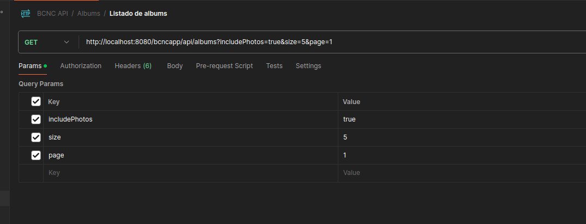

# API REST para gestión de Albums y Photos

## 1. Introducción

Este repositorio responde a la funcionalidad solicitada:

>Realizar un microservicio en SpringBoot que tenga 3 endpoints:
>1. ejecute un algoritmo que enriquezca unos datos obtenidos a través de un API (2 endpoints), para posteriormente
    >guardarlos en una base de datos en memoria H2.
>2. ejecute un algoritmo que enriquezca unos datos obtenidos a través de un API (2 endpoints) sin posibilidad de
    >utilizar base de datos y los devuelva en la petición.
>3. GET de la base de datos en memoria H2.

Requisitos:
- Por una parte tenemos “albums” y por otra las “photos”.
- Tenemos que obtener los “albums” en este endpoint: https://jsonplaceholder.typicode.com/albums
- Tenemos que obtener las “photos” en este endpoint: https://jsonplaceholder.typicode.com/photos
- Debemos enriquecer cada “álbum” para que tenga todas las “photos”.
- Realizar al menos un test unitario por funcionalidad.
- Realizar al menos un test de integración.
- IMPORTANTE: la eficiencia es lo más importante (elegir las estructuras de datos correctamente).

## 2. Instrucciones para la ejecución del proyecto

### 2.1 Arranque de la aplicación
1. Tener la versión 17 de Java
  - Comprueba la versión de Java instalada via `java --version`
  - Si no se dispone de la version 17, se debe instalar via:
    - `sudo apt install openjdk-17-jdk`
    - `sudo apt install openjdk-17-jre`
2. Nos situamos en la carpeta raiz del proyecto
3. Ejecutar el proyecto via: `./mvnw spring-boot:run`

### 2.2 Ejecución de los test

Ejecutar `./mvnw test`

## 3. Escenario funcional asumido

A la hora de desarrollar la prueba técnica, hay que asumir o establecer un escenario funcional ya que una interpretación u otra
pueden condicionar *diseño, validación de campos, configuración de JPA (En el caso de uso de base de datos relacional), estructuras
de datos a usar, etc...*

Se asume el siguiente escenario funcional:

- Una **foto** puede tener o no asociado un **album**. Es decir, la existencia de una fotografía no está ligada a su pertenencia a un álbum (Modelo Flickr).
- Un **album** puede estar vacío, presentando una relación O a N con las fotografías.
  - El borrado de un **album** (Capacidad extra incorporada), no implica el borrado es cascada de las fotos que contuviera.

- Nuestro microservicio podría estar siendo consumido por un front-end (Sencha Ext JS por ejemplo) que persigue las siguientes características:
  1. Se puede solicitar un listado de todos los **albums** incluyendo o no sus **fotos** vinculadas.
     - La capa frontal puede buscar mostrar en una vista todos los álbumes sin aún conocer sus fotografías vinculadas (Carga rápida).
       - Cuando se seleccione un álbum en particular, entonces se muestran las fotografías vinculadas (O puede ejecutarlo en segundo plano para ganar tiempo de respuesta en capa frontal).
     - Aunque implique un mayor tiempo, la capa frontal puede solicitar un listado de albums que contenga a su vez las fotos vinculadas.
     - Paginación de resultados (Mejora de experiencia de usuario y tiempo de respuesta en web)
       - Dividir resultados totales en n páginas
       - Obtener la página de resultados n
  2. Solicitar listado completo de fotografías
     - Paginación de resultados (Mejora de experiencia de usuario y tiempo de respuesta en web)
       - Dividir resultados totales en n páginas
       - Obtener la página de resultados n
- Validación de campos
  - Photo
    - Informar el título de una fotografía es obligatorio y su valor no puede exceder los 255 caracteres
    - Url (Opcional), su valor no puede exceder los 255 caracteres
    - ThumbnailUrl (Optional), su valor no puede exceder los 255 caracteres
  - Album
    - Informar el título de un album es obligatorio y su valor no puede exceder los 255 caracteres
    - Informar el id de usuario es obligatorio
- Orden de datos
  - No se exige un orden particular en los datos mostrados

## 4. Funcionalidades implementadas

Aparte de la funcionalidad especificada en el enunciado de la prueba, se ha decidido implementar una *API REST* que contenga
operaciones *CRUD* adicionales.

### 4.1 Carga de datos
- Carga de datos en base de datos en memoria H2 via endpoint
- Carga de datos sin el uso de base de datos via endpoint (Y devolución de resultados en llamada)
### 4.2 Con el uso de base de datos en memoria H2

- **Photos**
  - Obtener todas las fotografías (GET)
    - Posibilidad de paginado de resultados 
  - Búsqueda de una fotografía a partir de su ID (GET)
  - Creación de una fotografía (POST o PUT)
    - Validación de campos
  - Modificación de datos de una fotografía al completo (PUT)
    - Validación de campos
  - Modificación del título de una fotografía (PATCH)
    - Validación de campos
  - Borrado de una fotografía (DELETE)
- **Albums**
  - Obtener todos los albums (GET)
    - Posibilidad de paginado de resultados
    - Se otorga la posibilidad de incluir las fotografías asociadas o no en dicho listado
  - Búsqueda de un album a partir de su ID, incluyendo sus fotografías vinculadas (GET)
  - Creación de un album (POST o PUT)
    - Validación de campos
  - Modificación de datos de un album al completo (PUT)
    - Validación de campos
  - Modificación del título de un album (PATCH)
    - Validación de campos
  - Borrado de un album (DELETE)
  - Desvincular todas las fotografías de un album (GET) 

### 4.3 Sin el uso de base de datos

En este punto solo se exigía la devolución de los datos insertados en el propio end-point de carga de datos *(petición GET(/bcncapp/api/loadDataIntoMemory)*.
Sin embargo, se ha decidido implementar todas operaciones CRUD que están disponibles en la versión que interactúa con una base de datos H2  para mostrar la versatilidad del sistema.

Este punto ha supuesto bastante más trabajo por la dificultad que implicaba conseguir el propósito a través de una solución elegante (Uso de eventos de spring, selección de repositorio en tiempo de ejecución, etc...)

- **Photos**
  - Obtener todas las fotografías (GET)
  - Búsqueda de una fotografía a partir de su ID (GET)
  - Creación de una fotografía (POST o PUT)
    - Validación de campos
  - Modificación de datos de una fotografía al completo (PUT)
    - Validación de campos
  - Modificación del título de una fotografía (PATCH)
    - Validación de campos
  - Borrado de una fotografía (DELETE)
- **Albums**
  - Obtener todos los albums (GET)
    - Se otorga la posibilidad de incluir las fotografías asociadas o no en dicho listado
  - Búsqueda de un album a partir de su ID, incluyendo sus fotografías vinculadas (GET)
  - Creación de un album (POST o PUT)
    - Validación de campos
  - Modificación de datos de un album al completo (PUT)
    - Validación de campos
  - Modificación del título de un album (PATCH)
    - Validación de campos
  - Borrado de un album (DELETE)


### 4.4 Búsqueda de eficiencia y rendimiento

En base al escenario funcional descrito en la sección 2, en las funcionalidades implementadas se persigue:

- Rapidez a la hora de encontrar un album o foto en particular
- Rapidez a la hora de borrar un album o foto en particular
- Rapidez a la hora de insertar un album o foto en particular
- Versatilidad a la hora de obtener listado de fotografías o albums bajo diferentes criterios

## 5.Arquitectura

### 5.1 Estructuración del código

La primera decisión a abordar tras la creación del proyecto es cómo modularizar/estructurar el código. **Spring Boot** no impone ninguna restricción al respecto por lo que podemos optar por varias opciones:

1. Organizar paquetes por capas (Package by layer)
2. Organizar paquetes por característica (Package by feature)
3. Uso de arquitectura hexagonal
4. [Spring Modulith](https://spring.io/projects/spring-modulith)

Un dicho recurrente en la informática es que "no existe una bala de plata", es decir, se debe hacer uso del diseño, arquitectura, componentes que más se ajuste a las necesidades del problema.

De las opciones a considerar, teniendo en cuenta la dimensión del ejercicio, voy a contrastar el uso de las opciones 1 y 2.

>Organizar paquetes por capas (Package by layer)


Se trata del enfoque "clásico", en este modelo se organizan las clases en distintos paquetes que representan
distintas capas:

- Controller: Capa de presentación
- Service: Maneja todos los detalles de negocio (Capa de negocio)
- Repository: Se encarga del acceso a los datos (Capa de persistencia)
- Model: Reflejamos las entidades/clases de dominio

De esta forma, tendremos el código organizado en distintos paquetes que respondan a esta estructura:

- controller
  - photocontroller.java
  - albumcontroller.java
  - otrocontroller.java
- service
  - photoservice.java
- repository
  - photorepository.java
- model
  - photo.java
  - dto
    - photoDto.java

Por supuesto adicionalmente existirán paquetes correspondientes a configuración, excepciones, etc ...

> Organizar paquetes por característica (Package by feature)

En este modelo, los paquetes agrupan y contienen todas las clases que son requeridas para el desarrollo de
una característica. En nuestro caso sería:

- Album (package)
  - AlbumController.java
  - AlbumService.java
  - AlbumServiceImpl.java
  - AlbumRepository.java
  - Album.java
  - AlbumDto.java
- Photo (package)
  - PhotoController.java
  - PhotoService.java
  - PhotoServiceImpl.java
  - PhotoRepository.java
  - Photo.java
  - PhotoDto.java

> Decisión adoptada

En Ingeniería del Software, cuando tratamos de modularizar un sistema, idealmente buscamos conseguir una
**alta cohesión y bajo acoplamiento**.

Podemos definir **cohesión** como las relaciones existentes entres las clases o componentes de un módulo y
**acoplamiento** como las relaciones o dependencias existentes entre módulos.


Otro objetivo ideal a mencionar es la búsqueda de la máxima **encapsulación** posible, entendiéndolo como
la capacidad de limitar el acceso directo a nuestros datos, por ejemplo los componentes de un objeto.

Ateniéndonos a esto, la organización **por característica (Package by feature)** sería la ideal. ¿Por qué?

- No existe dependencia de uso de clases entre distintos paquetes. La funcionalidad de "Photo" tiene todas sus
  clases en el mismo paquete; controller, service, repository, etc..
- Las clases del mismo paquete están estrechamente relacionadas entre ellas

Esto representa claramente una **alta cohesión dentro de los paquetes y un bajo acomplamiento entre paquetes**,
así como una alta modularidad.

- Permite una mayor encapsulación de datos, ya que podemos situar la visibilidad de las clases al nivel de paquete
  en lugar de público (Por ejemplo en el diseño por capas Controller necesita saber de Service y están en distintos paquetes).

Este modelo es ideal para la elaboración de *microservicios* en un sistema de mayor magnitud la organización
nos permitiría tener identificada perfectamente los módulos y extraerlos en un microservicio.

El enfoque o la organización **por capas(Package by layer)** no presenta las ventajas anteriormente mencionadas.
Este enfoque de hecho presentaría justo lo contrario a lo que se busca idealmente, tendríamos **una baja cohesión
y un alto acoplamiento**.

Sin embargo, como se ha resaltado anteriormente, se debe intentar adaptar la arquitectura a las necesidades del problema afrontado.
Hay que tener en cuenta que estamos trabajando con un sistema no muy complejo, en el cual solo tenemos un
microservicio con 3 endpoints y que persigue unas funcionalidades muy determinadas. 

Por ello, se opta por **la estructuración en capas (package by layer)**, siendo un enfoque más orientado de momento al "monolito".

Me parece razonable empezar con esta organización "monolito" y si el sistema creciera (Se añaden usuarios, colecciones de albums, etc...), no cabe la menor duda que adoptar una
estructuración por característica sería el caballo ganador. Esta visión es compartida con el referente Martin Fowler https://www.martinfowler.com/bliki/MonolithFirst.html.

### 5.2 Patrones de diseño utilizados

> DTO (Data Transfer Object)

En el desarrollo se ha usado este patrón, englobado dentro de los patrones de distribución
ateniéndonos al libro de referencia *"Patterns of Enterprise Aplication Architecture"* de Martin Fowler:

- https://martinfowler.com/eaaCatalog/dataTransferObject.html

¿Por qué?

En cada desarrollo hay que analizar las necesidades y el escenario en el que se trabaja, y en función de eso adoptar una solución.
En este caso, busco que existe una separación clara entre las capas de presentación, servicio y persistencia.

Conceptualmente, la cada de presentación no tiene por qué conocer los detalles de la capa de persistencia (La entidad en este caso). El
uso de un objeto DTO nos permite añadir/acotar la información que se pretende mostrar al cliente (O recoger) a través de la API.

El uso de este patrón DTO puede tener ventajas o inconvenientes según el caso (Algunos lo consideran incluso un anti-patrón), pero en este, me parece
oportuno su uso por:

- Segregación entre capas, la capa de presentación no está acoplada con la capa de persistencia/modelo.
- En este caso no se realiza, pero por ejemplo podría buscarse mostrar al cliente atributos de dos entidades distintas, esto lo permite DTO.
  Imaginemos que un futuro, cuando se obtiene una fotografía via GET, además de conocer el id de album, nos piden conocer el título del album.
- Variedad en respuesta ofrecida en función de la petición. Esto se ha implementado en la solución a través de `AlbumWithPhotosDto y AlbumDto` (Mostrar album con fotografías asociadas o no, respectivamente)
- Se trabaja de forma cómoda en el mapping de DTO a Entidad usando la librería de mapeado *org.modelmapper*

> Mapper

Para la conversión de DTO a Entidad usamos el patrón de diseño "Mapper", englobado en los patrones de diseño "Base Patterns".

En este caso nos apoyamos en una librería externa *org.modelmapper* cuyo funcionamiento es adecuado, no reinventamos la rueda.

> Patrón estrategia

Podemos definir este patrón de comportamiento como:

*"Podemos definir una familia de algoritmos, colocar cada uno de ellos en una clase separada y hacer sus objetos intercambiables."*

Se ajusta a las necesidades del problema, ya que el desarrollo del ejercicio solicita:

- Almacenamiento de datos en memoria H2
- Almacenamiento de datos en memoria

Se puede identificar que estamos buscando distintas estrategias o algoritmos para almacenar/consultar los datos. Sería
un error que el sistema estuviera acoplado a una de las 2 necesidades concretas. Estaríamos violando el principio SOLID
**"Principio de inversión de dependencias"**:

"Las clases de alto nivel no deben depender de clases de bajo nivel. Ambas deben depender de abstracciones. Las
abstracciones no deben depender de detalles. Los detalles deben depender de abstracciones."

Aquí vemos un claro ejemplo de como hacerlo correctamente:


Se hace muy evidente con el ejemplo también, imaginemos que nuestra aplicación, aparte de H2 y memoria, también
quiere poder hacer uso de PostgreSQL y MondoDB. Sin un buen diseño, la cosa se pondría peor aún.

¿Cómo se ha aplicado este patrón en el ejercicio?

`PhotoRepository` y '`AlbumRepository`' representan la interfaz o abstracción mostrada en el dibujo anterior.

`AlbumInMemoryRepository` y 'PhotoInMemoryRepository' implementan la interfaz para definir una estrategia en concreto, en este caso la manipulación
de datos directamente en memoria.

- Inserción de datos en memoria H2

Cuando buscamos la inserción/consulta de datos en memoria H2 usamos el método GET "/bcncapp/api/loadDataIntoH2Memory" disponible
en `DataCollectorController`.

Siguiendo el flujo de llamada Controller -> Service -> ServiceImpl -> Repository, el momento en el que se
define la estrategia a definir es en la capa de negocio, en la clase `DataCollectorServiceImpl`.

Por defecto y como se puede observar en el constructor, el repositorio al que consultar será el que atañe
a la base de datos H2 determinado por la configuración:

```java
public interface AlbumRepository extends ListCrudRepository<Album, Long>, PagingAndSortingRepository<Album, Long>{
}

```

- Inserción de datos en memoria

Cuando buscamos la inserción/consulta de datos en memoria usamos el método GET "/bcncapp/api/loadDataIntoMemory" disponible
en `DataCollectorController`.

Siguiendo el flujo lógico de llamadas Controller -> Service -> ServiceImpl -> Repository, el momento en el que se
define la estrategia a definir es en la capa de negocio, en la clase `DataCollectorServiceImpl`.

En esta ocasión, desde el controlador se llama al método loadDataFromJsonPlaceHolderServerAndSaveIntoMemory().

En ese punto se especifica que hay que usar otra estrategia para salvar los datos, en este caso en memoria.

```java
    @Override
public List<AlbumDto> loadDataFromJsonPlaceHolderServerAndSaveIntoMemory() {

  getAppDataFromJsonPlaceHolderServer();

  logger.info("Almacenamiento de fotos en memoria");
  photoRepository = new PhotoInMemoryRepository();
  storePhotosDataInMemory();

  logger.info("Almacenamiento de albums en memoria");
  albumRepository = new AlbumInMemoryRepository();
  storeAlbumsDataInMemory();

  return albumsFromJsonPlaceHolderServiceList.stream().map(this::buildAlbumDtoCompleteInformation).toList();
}

```
Ahora acudiremos a una estrategia o implementación concreta, que es `AlbumInMemoryRepository` y `PhotoInMemoryRepository`:

```java
public class PhotoInMemoryRepository implements PhotoRepository {
    
}

public class AlbumInMemoryRepository implements AlbumRepository {
    
}
```
El uso de este patrón también nos lleva al cumplimiento del principio SOLID **"Principio abierto/cerrado"**, ya que
podemos introducir tantas estrategias (O bases de datos en nuestro caso) como deseemos sin tener que cambiar el contexto del código.

### 5.3 Gestión de excepciones

La gestión de excepciones la realizamos haciendo uso de la anotación `@ControllerAdvice`.

- https://docs.spring.io/spring-framework/docs/current/javadoc-api/org/springframework/web/bind/annotation/ControllerAdvice.html

Se busca una gestión global de todas las excepciones que pueda provocar la aplicación. El resultado es la creación de la clase `GlobalExceptionHandler`

Esto lo va a realizar la función:

```java
@ExceptionHandler({PhotoNotFoundException.class, PhotoWithSameTitleException.class,
            AlbumNotFoundException.class, AlbumWithSameTitleException.class, Exception.class})
    public final ResponseEntity<ErrorResponse> handleException(Exception exception) {

        LOGGER.error("Manejo de la excepción " + exception.getClass().getSimpleName() + ". Motivo: "
                + exception.getMessage());

        if (exception instanceof PhotoNotFoundException) {
            return buildResponseEntity(HttpStatus.NOT_FOUND, exception);
        } else if (exception instanceof AlbumNotFoundException) {
            return buildResponseEntity(HttpStatus.NOT_FOUND, exception);
        } else if (exception instanceof AlbumWithSameTitleException) {
            return buildResponseEntity(HttpStatus.OK, exception);
        } else if (exception instanceof PhotoWithSameTitleException) {
            return buildResponseEntity(HttpStatus.OK, exception);
        } else {
            return buildResponseEntity(HttpStatus.INTERNAL_SERVER_ERROR, exception);
        }
    }
```

Tenemos estipuladas una serie de excepciones que puede producir el uso de la aplicación como se observa y las
reflejamos en la anotación `@ExceptionHandler`.

Cuando en la aplicación se produzca una excepción de estos tipos, será gestionada en este método. En función de su
tipo, en este caso se crea una `ResponseEntity<ErrorResponse>` con un status determinado.

La motivación es clara, de no ser gestionado así, en cada método de las clases Controller que produzca una excepción, debería
crearse un método para gestionar la excepción con la anotación @ExceptionHandler.

Varios controladores pueden producir la misma excepción, por lo cual estaríamos repitiendo código de gestión de error. Además, esta
enfoque de gestión de excepciones presenta un código más claro y conciso. Desde un mismo punto, visibilizamos y gestionamos las excepciones.

Para tratar los errores provocados por la validación de ciertos campos, se sobreescribe el método
handleMethodArgumentNotValid() heredado de la clase padre ResponseEntityExceptionHandler.

### 5.4 Decisiones "relativas" al ecosistema Spring

- **Inyección de dependencias por campo VS inyección de dependencias por constructor**

Por lo general, se recomienda inyectar dependencias a través del constructor, pero no debe de ser un dogma. En determinadas
ocasiones la inyección por campo es adecuada (Imaginemos una clase que tuviera 10 dependencias y todas las hacemos via constructor, eso huele mal).

Se ha adoptado un enfoque mixto dependiendo de las circunstancias

- **Posibilidad de establecer en tiempo de ejecución el repositorio usado en función de si la carga de datos se ha hecho en base de datos H2 o no** (Uso de Beans)

En el ejercicio se pedía que en el caso de la carga de datos sin base de datos, en la propia petición se devuelvan los mismos. Sin embargo, he decidido ir un poco más allá y permitir que todas las operaciones CRUD implementadas también operen tras esta carga inicial.

Como se ha citado anteriormente, se había previsto el uso de un repositorio u otro según el end-point llamado usando el patrón estrategia.
Hasta ahí bien, pero ha surgido el problema técnico de cómo establecer de forma dinámica que las operaciones CRUD apuntaran
a los repositorios que no usan base de datos `PhotoInMemoryRepository` y `AlbumInMemoryRepositoryImpl`.

Tras realizar la carga inicial, usando GET '/bcncapp/api/loadDataIntoMemory', las operaciones findAll() y findById() no
obtenían datos ya que se apuntaba por defecto al repositorio "relativo a H2" (Si no estuviéramos sujetos a una carga de datos por end-point se podría enfocar de otra forma).

Se me ha ocurrido una solución para esto:
- Uso de eventos de Spring
- Creación de un componente "que recuerda que tipo de carga se ha hecho (almacenando sus repositorios)"

1. Cuando se realiza una carga de datos sin usar base de datos, en la clase `DataCollectorServiceImpl` el componente`RepositoriesSelector`
recoge los repositorios usados bajo esa estrategia.
2. Lanza un evento específico creado que indicará que se ha hecho dicho tipo de carga:
  - `DatosCargadosEnMemoriaInternaEvent`

Creamos un publicador y un listener para la gestión de dicho evento a su vez: `DatosCargadosEnMemoriaEventListener` y `DatosCargadosEnMemoriaEventPublisher` 

3. En el listener `DatosCargadosEnMemoriaEventListener` ante la recepción del evento:
   - Se obtienen las implementaciones de la capa servicio `AlbumServiceImpl` y `PhotoServiceImpl` que serán usadas como sabemos por los controladores.
   - Toleramos la posibilidad de establecer repositorios en dichas clases (SetRepository()) y le establecemos los repositorios que recogimos
   anteriomente y que están almacenados en `repositoriesSelector`.

Con esto, conseguimos que todo el conjunto de operaciones implementadas funcionen también para el caso de carga de datos sin base de datos de forma transparente.


### 5.5 Diseño de la base de datos H2/Entidades

En el caso de la carga de datos en base de datos H2, a la hora de configurar relaciones entre las entidades y atendiendo a la casuística del problema, una idea inicial en cuanto a configuración JPA fue:

- En la entidad `Photo`

```java
@ManyToOne(fetch = FetchType.LAZY)
@JoinColumn(name = "album_id")
private Album album;

```
- En la entidad `Album`

```java
@OneToMany(mappedBy = "album")
private List<Photo> photoList;
```

Sin embargo, teniendo en cuenta que con los requisitos funcionales asumidos y la información obtenida (La foto contiene la referencia al album),
una configuración más sencilla era posible y a su vez podría cumplir con garantías las funcionalidades de relación entre estas 2 entidades.

### 5.6 Clean code y principios SOLID

Se ha intentado elaborar un código lo más limpio posible. El uso o no de comentarios es un tema que genera mucha controversia, yo en este
caso he intentado usarlos lo más mínimo.

En otro contexto (Y siempre y cuando no sea la respuesta a un código poco descriptivo) si que podría aportarse una mayor descripción de cada clase en su encabezado, documentar con mayor detalle algún método, javadocs, etc..

Para describir las operaciones expuestas en el microservicio en este caso he optado por la customización via OpenApi.

En cuanto al código que se ajusta a los principios **SOLID** (Se debe recordar que no son en sí un dogma, sino una solución ante la aparición de code smells), algunos se han citado en el documentación aunque podemos recapitularlos en este punto.

1. **Principio de responsabilidad única (SRP)**

Podríamos decir que nuestro sistema cumple este principio ya se ha intentado realizar una delimitación clara de responsabilidades:

- Capa controladora: Expone las operaciones, valida y construye la respuesta basándose en lo obtenido en la capa de servicio
- Capa de servicios: Tiene la responsabilidad de gestionar la lógica de negocio (Mapeamos entidades a dto y viceversa, paginación, etc..)
- Capa de persistencia: Las clases de persistencia se dedican únicamente a interactuar con la base de datos (En el caso que se usen) y entidades

2. **Principio abierto-cerrado (OCP)**

Este principio lo podemos ver a través del patrón estrategia que hemos implementado.

Imaginemos que aparte del uso de base de datos en memoria H2, se quisiera usar otro tipo de base de datos; MySql, MongoDB.

Lo que tendríamos que hacer en este caso es crear una implementación de la interfaz existente. Es decir, el sistema
va a estar cerrado ya que la capa de servicio se abstrae totalmente de estas opciones y está abierto porque se permiten nuevas
implementaciones (Base de datos en este caso).

3. **Principio de sustitución de Liskov (LSP)**

Este principio está presente en las clases `AlbumDto y AlbumWithPhotoDto`.

El método `findAll` de la clase `AlbumServiceImpl` se adapta sin problema al uso de la clase padre (AlbumDto) o la clase hija (AlbumWithPhotoDto).

4. **Principio de segregación de la interfaz (ISP)**

5. **Principio de inversión de dependencias (DIPp**

Mencionado en el apartado de "5.2 Patrones de diseño utilizados"

## 6. Desarrollo

### 6.1 Tecnologías framework/usados

Para el desarrollo he utilizado *Intellij* y en lo que atañe a Git, utilizo *GitKraken* por lo muchísimo que facilita el trabajo.

La creación de esqueleto del proyecto con las dependencias inicialmente consideradas se ha hecho con *Spring Initializr* https://start.spring.io/.

### 6.2 GIT

Para el desarrollo del proyecto he seguido el estándar de trabajo diario y que considero bueno.

1. Creación de una rama principal: *develop*
2. En este ejercicio se nos pide desarrollar 3 funcionalidades distintas que podríamos canalizar en 3 tareas de distintas
   por ejemplo en JIRA.
  3. Para cada funcionalidad, se crea una rama: feature/BCNC-XXX-XXX
    - Expresamos de la forma más clara posible en los COMMITS en qué se ha trabajado.
3. Cuando la funcionalidad se ha finalizado (O se quiere hacer una subida), se hace push de dicha rama.
4. En Github, de igual forma que haríamos en BitBucket por ejemplo y aunque aquí no hay un equipo, se hace una *Pull request*
   para incorporar la funcionalidad de la rama en develop. Si todo está correcto, se aprueba y se mergea.
5. En cada funcionalidad/fix/etc ... que se quiera incorporar, se repite este proceso.


### 6.3 Primer endpoint: feature/BCNC-001-primer-endpoint

Esta rama canaliza el desarrollo del primer endpoint del microservicio:

- Realizar un endpoint que ejecute un algoritmo que enriquezca unos datos obtenidos a través de un API (2 endpoints),
  para posteriormente guardarlos en una base de datos en memoria H2.

Los endpoints de un servicio externo de los que se va a obtener información de "photos" y "albums" son:
- https://jsonplaceholder.typicode.com/photos
- https://jsonplaceholder.typicode.com/albums

En primer lugar, aunque en el enunciado se define que esta carga de datos se haga a través de un endpoint, merece
la pena mencionar que esta carga inicial se podía haber hecho al iniciar la aplicación Spring Boot sin necesidad
de llamar al servicio a través de:

```java
@SpringBootApplication
public class PruebatecnicabcncApplication {

   public static void main(String[] args) {
      SpringApplication.run(PruebatecnicabcncApplication.class, args);
   }

   @Bean
   CommandLineRunner commandLineRunner(PhotoRepository photoRepository, AlbumRepository albumRepository) {
      return args -> {

         // Carga de photos
         // Carga de albums
      };
   }
}
```

El endpoint que va a realizar esta carga inicial de datos se va a situar en la clase `DataCollectorControler`.

Dados estos requisitos, para la obtención de estos datos nos situamos en el lado del "cliente" y vamos a obtener
los mismos a través de *interfaces http*.

Antes de la aparición de Spring 3.0.0 podríamos haber usado "restTemplate".

En la clase PhotoService en primer lugar obtenemos todos los datos a través de:

```java

@Service
public class PhotoServiceImpl implements PhotoService {

    private final RestTemplate restTemplate;

    public PhotoService(RestTemplate restTemplate) {
        this.restTemplate = restTemplate;
    }

    public List<Photo> loadPhotos() {

        ResponseEntity<List<Photo>> exchange = restTemplate.exchange("https://jsonplaceholder.typicode.com/photos",
                HttpMethod.GET,
                null,
                new ParameterizedTypeReference<List<Photo>>() {});

        return exchange.getBody();
    }
}

```
Declarando el Bean correspondiente en la aplicación

```java
@Bean
RestTemplate restTemplate() {
return new RestTemplate();
}
```

El segundo paso sería insertar estos datos en nuestra base de H2. Este código funciona perfectamente y no hay pegas al respecto, pero estamos necesitando:

- Declarar en la clase servicio este baile con el httpcliente usando exchange y tener que averiguar
  qué parÁmetros y método elegir. Además, en la API existen numerosos de métodos override, hay que saber
  cuál usar, etc...

Esto lo podemos solucionar con *HTTP Interfaces*. Spring Framework no permite utilizar HTTPService como una interfaz Java
tal y como hace con los repositorios. Posteriormente, se puede declarar un proxy en tiempo de ejecución para implementar esos métodos
de intercambio de la interfaz.

A través del cliente http implementado `JsonPlaceHolderService`, somos capaces de llamar a cualquier endpoint ofrecido por el servidor externo del mismo de forma muy sencilla.

La implementación de esta interfaz cliente http se realiza en la capa de servicio. Concretamente en la clase `DataCollectorServiceImpl` :

```java
 /*
     * Construcción de la interfaz HTTP Client
     * @return JsonPlaceHolderService
     */
    private JsonPlaceHolderService buildJsonPlaceHolderService() {

        WebClient webClient = WebClient
                .builder()
                .baseUrl(JsonPlaceHolderService.BASE_URL)
                .exchangeStrategies(ExchangeStrategies
                        .builder()
                        .codecs(codecs -> codecs
                                .defaultCodecs()
                                .maxInMemorySize(50 * 1024 * 1024))
                        .build())
                .build();


        HttpServiceProxyFactory httpServiceProxyFactory = HttpServiceProxyFactory
                .builderFor(WebClientAdapter.create(webClient)).build();

        return httpServiceProxyFactory.createClient(JsonPlaceHolderService.class);
    }
```
Como se observa, debido a la carga de los 5000 registros de fotografías, se ha tenido que aumentar la memoria para ello a 50 MB.

``
codec:
max-in-memory-size: 50MB
``

> 6.3.1 Optimizaciones adicionales

> 6.3.1.1 Batch a la hora de guardar los datos en base de datos

El escenario de la prueba técnica presenta una carga de datos provenientes de un servidor externo:

- 5000 registros de fotografías
- 100 registros de albums

Estos datos, posteriormente se insertan en una base de datos H2.

En el ámbito de las fotografías y para este contexto, podemos considerar que estamos trabajando con un volumen de datos
de "cierta" magnitud. Ante esto e imaginando que surgiera un requisito de una carga muchísimo mayor de datos tanto de
fotos como álbumes, se puede hacer que entre en juego el procesado de datos por lotes (batch) o por trozos (chunks).

En nuestro caso, el punto crítico está en la inserción inicial de 5000 registros de fotos y 100 de albums. Estos se hacen
en queries unitarias, lo podemos observar activando la propiedad:

``` java
  jpa:
    show-sql: false
    properties:
      hibernate:
        format_sql: false
        generate_statistics: true
```
``` java
2024-01-29T00:28:05.641+01:00  INFO 63654 --- [nio-8080-exec-1] i.StatisticalLoggingSessionEventListener : Session Metrics {
    25955 nanoseconds spent acquiring 1 JDBC connections;
    0 nanoseconds spent releasing 0 JDBC connections;
    23949080 nanoseconds spent preparing 10200 JDBC statements;
    128233407 nanoseconds spent executing 10200 JDBC statements;
    0 nanoseconds spent executing 0 JDBC batches;
    0 nanoseconds spent performing 0 L2C puts;
    0 nanoseconds spent performing 0 L2C hits;
    0 nanoseconds spent performing 0 L2C misses;
    16032618 nanoseconds spent executing 2 flushes (flushing a total of 5200 entities and 0 collections);
    0 nanoseconds spent executing 0 partial-flushes (flushing a total of 0 entities and 0 collections)
```
También podemos medir el tiempo (ms) de inserción de albums y fotos y reflejarlo en el log:
``` java
2024-01-29T00:30:08.697+01:00  INFO 64225 --- [nio-8080-exec-2] d.f.p.service.DataCollectorServiceImpl   : Obtención de albums consumiendo el end-point https://jsonplaceholder.typicode.com/albums 
2024-01-29T00:30:08.698+01:00  INFO 64225 --- [nio-8080-exec-2] d.f.p.service.DataCollectorServiceImpl   : Almacenamiento de datos obtenidos en memoria H2
2024-01-29T00:30:09.798+01:00  INFO 64225 --- [nio-8080-exec-2] d.f.p.service.DataCollectorServiceImpl   : Almacenamiento de albums
2024-01-29T00:30:09.929+01:00  INFO 64225 --- [nio-8080-exec-2] d.f.p.service.DataCollectorServiceImpl   : Tiempo consumido: 130
2024-01-29T00:30:09.929+01:00  INFO 64225 --- [nio-8080-exec-2] d.f.p.service.DataCollectorServiceImpl   : Almacenamiento de fotos
2024-01-29T00:30:10.581+01:00  INFO 64225 --- [nio-8080-exec-2] d.f.p.service.DataCollectorServiceImpl   : Tiempo consumido: 652
```

Procedemos a la activación de inserción de datos por lotes de la siguiente forma:

1. En las entidades Album y Photo, la generación del id pasa de ser:

@GeneratedValue(strategy = GenerationType.IDENTITY)
a
@GeneratedValue(strategy = GenerationType.SEQUENCE)

2. Establecemos las propiedades que activan este batch, probamos varios valores, finalmente estableciendo 50.

```java
        order_inserts: true
        order_updates: true
        jdbc:
          batch_size: 50

```

Los resultados obtenidos nos muestran que el batch por lotes de 50 tiene efecto y mejora los resultados:

```java
2024-01-29T00:35:23.255+01:00  INFO 64851 --- [nio-8080-exec-1] d.f.p.service.DataCollectorServiceImpl   : Obtención de albums consumiendo el end-point https://jsonplaceholder.typicode.com/albums 
2024-01-29T00:35:23.256+01:00  INFO 64851 --- [nio-8080-exec-1] d.f.p.service.DataCollectorServiceImpl   : Almacenamiento de datos obtenidos en memoria H2
2024-01-29T00:35:24.154+01:00  INFO 64851 --- [nio-8080-exec-1] d.f.p.service.DataCollectorServiceImpl   : Almacenamiento de albums
2024-01-29T00:35:24.252+01:00  INFO 64851 --- [nio-8080-exec-1] d.f.p.service.DataCollectorServiceImpl   : Tiempo consumido: 97
2024-01-29T00:35:24.252+01:00  INFO 64851 --- [nio-8080-exec-1] d.f.p.service.DataCollectorServiceImpl   : Almacenamiento de fotos
2024-01-29T00:35:24.584+01:00  INFO 64851 --- [nio-8080-exec-1] d.f.p.service.DataCollectorServiceImpl   : Tiempo consumido: 331
2024-01-29T00:35:24.594+01:00  INFO 64851 --- [nio-8080-exec-1] i.StatisticalLoggingSessionEventListener : Session Metrics {
    35980 nanoseconds spent acquiring 1 JDBC connections;
    0 nanoseconds spent releasing 0 JDBC connections;
    10310465 nanoseconds spent preparing 5206 JDBC statements;
    47096678 nanoseconds spent executing 5204 JDBC statements;
    29612351 nanoseconds spent executing 102 JDBC batches;
    0 nanoseconds spent performing 0 L2C puts;
    0 nanoseconds spent performing 0 L2C hits;
    0 nanoseconds spent performing 0 L2C misses;
    120873696 nanoseconds spent executing 2 flushes (flushing a total of 5200 entities and 0 collections);
    0 nanoseconds spent executing 0 partial-flushes (flushing a total of 0 entities and 0 collections)
```

102 JDBC batches de 50 registros que han conseguido reducir el rendimiento en términos de tiempo de carga (En el caso de
las fotos hasta casi la mitad)

> 6.3.1.2 Paginación de resultados (Disponible independientemente del método de almacenamiento que se prefiera)

Se añade la funcionalidad de paginación de resultados haciendo que la interfaz extienda la funcionalidad de la
interfaz `PagingAndSortingRepository`.

En la petición de fotos y albums se puede indicar (Por defecto no se hace paginación):
- El nº de registros contenidos en cada página
- Si se ha paginado, seleccionado el nº de página en la que situarnos



> 6.3.1.3 Posibilidad de mostrar fotos asociadas a album en listado o no

Como se muestra en la imagen anterior, en la obtención de albums se incluye la posibilidad de mostrar sus fotografías vinculadas o no.

### 6.4 Segundo endpoint: feature/BCNC-002-segundo-endpoint

En este desarrollo se nos solicita:

1. Obtención de datos por parte del servidor JsonPlaceHolder
2. Salvar datos obtenidos en memoria (No uso de base datos)
3. Devolver los datos en la propia petición

El end-point que se va a encargar de esto (**/bcncapp/api/loadDataIntoMemory**) se puede localizar en la clase `DataCollectorController`.

Teniendo en cuenta el escenario funcional asumido, se realiza un estudio de cara a identificar qué estructuras de datos van
a ser nuestras aliadas en esta tarea.

Existe numerosa bibliografía al respecto, acompañada de pruebas y estudios de rendimiento. Sin el propósito de
reinventar la rueda y dado que me parecía interesante, se ha realizado un de "benchmark adaptado" para este desarrollo.

Se ha canalizado en una clase Test (`EstudioEficienciaTest`), donde partiendo del conjunto de datos reales de fotografías obtenidas (5000 elementos),
se ha probado las operaciones de lectura, inserción y borrado sobre las siguientes estructuras de datos:

- Iterable
  - Collection
    - Listas
      - **ArrayList**
      - **LinkedList**
    - Set
      - **HashSet**
      - **LinkedHashSet**
      - **TreeSet**
- Map
  - **HashMap**
  - SortedMap
    - **TreeMap**

Basta con ejecutar el test *estudioEficienciaDeEstructuras*, los resultados mostrados son:

```java
12:04:08.919 [main] INFO dev.franciscolorite.pruebatecnicabcnc.estudioeficiencia.EstudioEficienciaTest -- ---- Estudio de eficiencia de estructuras que implementan interfaz Collection ----
12:04:08.920 [main] INFO dev.franciscolorite.pruebatecnicabcnc.estudioeficiencia.EstudioEficienciaTest -- --- Estudio de eficiencia de List ---
12:04:09.592 [main] INFO dev.franciscolorite.pruebatecnicabcnc.estudioeficiencia.EstudioEficienciaTest -- -- Estudio de ArrayList --
12:04:09.594 [main] INFO dev.franciscolorite.pruebatecnicabcnc.estudioeficiencia.EstudioEficienciaTest -- Tiempo consumido por el borrado de un elemento según posición: 11756 nanoseconds
12:04:09.594 [main] INFO dev.franciscolorite.pruebatecnicabcnc.estudioeficiencia.EstudioEficienciaTest -- Tiempo consumido por la busqueda de un elemento según posición 4555: 163056 nanoseconds
12:04:09.594 [main] INFO dev.franciscolorite.pruebatecnicabcnc.estudioeficiencia.EstudioEficienciaTest -- Tiempo consumido por la inserción de un elemento: 4288 nanoseconds
12:04:09.594 [main] INFO dev.franciscolorite.pruebatecnicabcnc.estudioeficiencia.EstudioEficienciaTest -- -- Estudio de LinkedList --
12:04:09.595 [main] INFO dev.franciscolorite.pruebatecnicabcnc.estudioeficiencia.EstudioEficienciaTest -- Tiempo consumido por el borrado de un elemento según posición: 8027 nanoseconds
12:04:09.595 [main] INFO dev.franciscolorite.pruebatecnicabcnc.estudioeficiencia.EstudioEficienciaTest -- Tiempo consumido por la busqueda de un elemento según posición 4555: 49082 nanoseconds
12:04:09.595 [main] INFO dev.franciscolorite.pruebatecnicabcnc.estudioeficiencia.EstudioEficienciaTest -- Tiempo consumido por la inserción de un elemento: 2043 nanoseconds
12:04:09.595 [main] INFO dev.franciscolorite.pruebatecnicabcnc.estudioeficiencia.EstudioEficienciaTest -- --- Estudio de eficiencia de Set ---
12:04:09.651 [main] INFO dev.franciscolorite.pruebatecnicabcnc.estudioeficiencia.EstudioEficienciaTest -- -- Estudio de HashSet --
12:04:09.653 [main] INFO dev.franciscolorite.pruebatecnicabcnc.estudioeficiencia.EstudioEficienciaTest -- Tiempo consumido por la busqueda de un elemento según objeto: 10952 nanoseconds
12:04:09.653 [main] INFO dev.franciscolorite.pruebatecnicabcnc.estudioeficiencia.EstudioEficienciaTest -- Tiempo consumido por el borrado de un elemento según objeto: 7779 nanoseconds
12:04:09.653 [main] INFO dev.franciscolorite.pruebatecnicabcnc.estudioeficiencia.EstudioEficienciaTest -- Tiempo consumido por la inserción de un elemento: 4628 nanoseconds
12:04:09.653 [main] INFO dev.franciscolorite.pruebatecnicabcnc.estudioeficiencia.EstudioEficienciaTest -- -- Estudio de LinkedHashSet --
12:04:09.654 [main] INFO dev.franciscolorite.pruebatecnicabcnc.estudioeficiencia.EstudioEficienciaTest -- Tiempo consumido por la busqueda de un elemento según objeto: 3243 nanoseconds
12:04:09.654 [main] INFO dev.franciscolorite.pruebatecnicabcnc.estudioeficiencia.EstudioEficienciaTest -- Tiempo consumido por el borrado de un elemento según objeto: 4261 nanoseconds
12:04:09.655 [main] INFO dev.franciscolorite.pruebatecnicabcnc.estudioeficiencia.EstudioEficienciaTest -- Tiempo consumido por la inserción de un elemento: 2601 nanoseconds
12:04:09.655 [main] INFO dev.franciscolorite.pruebatecnicabcnc.estudioeficiencia.EstudioEficienciaTest -- -- Estudio de TreeSet --
12:04:09.660 [main] INFO dev.franciscolorite.pruebatecnicabcnc.estudioeficiencia.EstudioEficienciaTest -- Tiempo consumido por la busqueda de un elemento según objeto: 18090 nanoseconds
12:04:09.660 [main] INFO dev.franciscolorite.pruebatecnicabcnc.estudioeficiencia.EstudioEficienciaTest -- Tiempo consumido por el borrado de un elemento según objeto: 20215 nanoseconds
12:04:09.660 [main] INFO dev.franciscolorite.pruebatecnicabcnc.estudioeficiencia.EstudioEficienciaTest -- Tiempo consumido por la inserción de un elemento: 4887 nanoseconds
12:04:09.660 [main] INFO dev.franciscolorite.pruebatecnicabcnc.estudioeficiencia.EstudioEficienciaTest -- ---- Estudio de eficiencia de estructuras que implementan interfaz Map ----
12:04:09.716 [main] INFO dev.franciscolorite.pruebatecnicabcnc.estudioeficiencia.EstudioEficienciaTest -- -- Estudio de HashMap --
12:04:09.717 [main] INFO dev.franciscolorite.pruebatecnicabcnc.estudioeficiencia.EstudioEficienciaTest -- Tiempo consumido por la busqueda de un elemento según index 4555: 8681 nanoseconds
12:04:09.717 [main] INFO dev.franciscolorite.pruebatecnicabcnc.estudioeficiencia.EstudioEficienciaTest -- Tiempo consumido por el borrado de un elemento según hash index: 25028 nanoseconds
12:04:09.717 [main] INFO dev.franciscolorite.pruebatecnicabcnc.estudioeficiencia.EstudioEficienciaTest -- Tiempo consumido por la inserción de un elemento: 2966 nanoseconds
12:04:09.717 [main] INFO dev.franciscolorite.pruebatecnicabcnc.estudioeficiencia.EstudioEficienciaTest -- -- Estudio de TreeMap --
12:04:09.727 [main] INFO dev.franciscolorite.pruebatecnicabcnc.estudioeficiencia.EstudioEficienciaTest -- Tiempo consumido por la busqueda de un elemento según index 4555: 48242 nanoseconds
12:04:09.727 [main] INFO dev.franciscolorite.pruebatecnicabcnc.estudioeficiencia.EstudioEficienciaTest -- Tiempo consumido por el borrado de un elemento según hash index: 8899 nanoseconds
12:04:09.727 [main] INFO dev.franciscolorite.pruebatecnicabcnc.estudioeficiencia.EstudioEficienciaTest -- Tiempo consumido por la inserción de un elemento: 11786 nanoseconds
```
Un artículo de gran utilidad a mi modo de parecer es: https://www.baeldung.com/java-choose-list-set-queue-map

> 6.4.1 Tiempo de respuesta y consumo de memoria

Dados los requisitos de la solución, podemos descartar en primer lugar las estructuras de datos:
- **TreeSet**
- **TreeMap**

No queremos un orden específico de los elementos y en ambas estructuras, sus operaciones de **añadir, eliminar y buscar** un elemento tienen una complejidad de
*O(log(n))*, es decir, el tiempo de respuesta irá creciendo logarítmicamente a medida que crezca el conjunto de datos, esto es un incoveniente.

En cuanto a uso de la interfaz List, en otro contexto el uso de ArrayList o LinkedList podía ser interesante.
Sin embargo, en este caso buscamos rapidez a la hora de acceder y borrar un elemento (Photo o album).

- ArrayList: Presenta el incoveniente de que contains() y remove() tienen una complejidad de O(n).
- LinkedList: Presenta el incoveniente de que get() y remove() tienen una complejidad de O(n).

No deseamos ese tiempo O(n) porque crecerá linearmente, cuanto más datos tengamos, más lentas serán las operaciones.

De esta forma nos quedan en el tintero **HashSet**, **LinkedHashSet** y **HashMap**.

**HashSet** y **LinkedHashSet** presentan rendimientos muy interesantes (Se puede observar en datos) en acceso, inserción y eliminado: 0(1),
es decir, el tiempo es constante con independencia del tamaño de los datos.

Sin embargo, dada las características del problema, me parece acertado el uso de **HashMap**. ¿Por qué?

Los datos de albums y photos obtenidos del servidor (usando interfaz HTTP client) son almacenados en listas (Los repositorios
de photos y albums implementan ListCrudRepository).

Es decir, la carga de datos por parte del end-point se hará en listas, hasta ahí sin problemas.

Tanto photos como albums tienen un identificador único (id) y además sabemos que un album puede tener un conjunto
de photos.

Se presenta así un escenario ideal para el uso de HashMap, ya que como bien sabemos, sus tiempos de acceso, inserción y borrado son 0(1).

- Albums

Los albums serán almacenados en una estructura:

```java
private final HashMap<Long, Album> albumsMap;

public AlbumInMemoryRepository() {
  albumsMap = new HashMap<>();
}
```

Somos capaces de:
- Obtener una album dado su id en 0(1), crucial para la modificación.
- Borrar una foto dado su id en 0(1)
- Insertar una foto en 0(1)


- Photos

Los albums serán almacenados en las estructuras:

```java
private final Map<Long, Photo> photosMap;
private final Map<Long, List<Photo>> photosByAlbumIdMap;

```

```java
private final Map<Long, Photo> photosMap;
private final Map<Long, List<Photo>> photosByAlbumIdMap;

public PhotoInMemoryRepository() {
  photosMap = new HashMap<>();
  photosByAlbumIdMap = new HashMap<>();
}
```

Somos capaces de:
- Obtener una foto dado su id en 0(1), crucial para la modificación.
- Borrar una foto dado su id en 0(1)
- Insertar una foto en 0(1)
- Dado que conocemos el albumId, obtener todas las fotografías que contiene un album en 0(1)

En ambos casos, al ser la clave el id, aseguramos la no repetición de datos.

En términos de **consumo de memoria** una estructura ArrayList almacena tan solo los valores y mantiene
internamente el indexado para cada elemento, mientras que **HashMap** almacena los elementos con clave y valor, lo
que implica dos objetos.

Hashmap consume más memoria, pero en este caso compensa.

Todas estas operaciones están canalizadas en los repositorios PhotoInMemoryRepository y AlbumInMemoryRepository.

### 6.5 Tercer endpoint: feature/BCNC-003-tercer-endpoint

La documentación ya existente describe el desarrollo (Y las funcionalidades extra) de este punto

### 6.6 Mejoras: feature/BCNC-004-mejoras

En esta rama se han añadido/desarrollado una serie de mejoras, entre ellas:

- Una serie de mejoras asociadas a la validación de los campos introducidos en las peticiones POST
  - Photos
    - Se valida que el campo **titulo** se informe a la hora de realizar una operación POST o PUT, que no esté vacío y que no conteng más de 255 caracteres (Se asume que estamos cómodo con un VARCHAR(255))
    - Se valida que los campos **url** y **thumbnailUrl** no superen los 255 caracteres.
  - Albums
    - Se valida que el campo **titulo** se informe a la hora de realizar una operación POST o PUT, que no esté vacío y que no conteng más de 255 caracteres (Se asume que estamos cómodo con un VARCHAR(255))


## 7.Documentación de la API
### Swagger


Se ha documentado la API desarrollada a través de **Swagger** y se ha customizado la misma haciendo uso de **OpenApi**.

Una vez ejecutado el proyecto, encontraremos la documentación en el siguiente enlace:
- http://localhost:8080/swagger-ui/index.html (Formato .html)
- http://localhost:8080/v3/api-docs (Formato .json)

## 8.Testing y medición de calidad de código

### 8.1 Test unitarios y test de integración

Los métodos CRUD implementados para las clases PhotoController y AlbumController, se han testeado en las
clase AlbumControllerTest y PhotoControllerTest.

Se ha usado *JUnit 5* y para no depender de una base de datos se ha usado *Mockito*.

Los test de integración están recogidos en clases:
- AlbumControllerIT
- PhotoControllerIT
- DataCollectorControllerIT

Para los test de integración se ha hecho uso de **MockMvc**.

### 8.2 Postman


Se ha hecho uso de la herramienta **Postman** para el testing de los servicios.

El archivo que contiene el conjunto de pruebas, clasificadas por controlador y funcionalidad, está disponible
en los resources del proyecto: */resources/postman/BCNC API.postman_collection.json*

## 8.3 Cobertura de código

Para analizar la cobertura de código se ha usado la herramienta de Intellij 'Run tests with coverage'.


## 8.4 Calidad de código

La calidad del código se ha ido vigilando también a través de las herramientas ofrecidas por Intellij.
